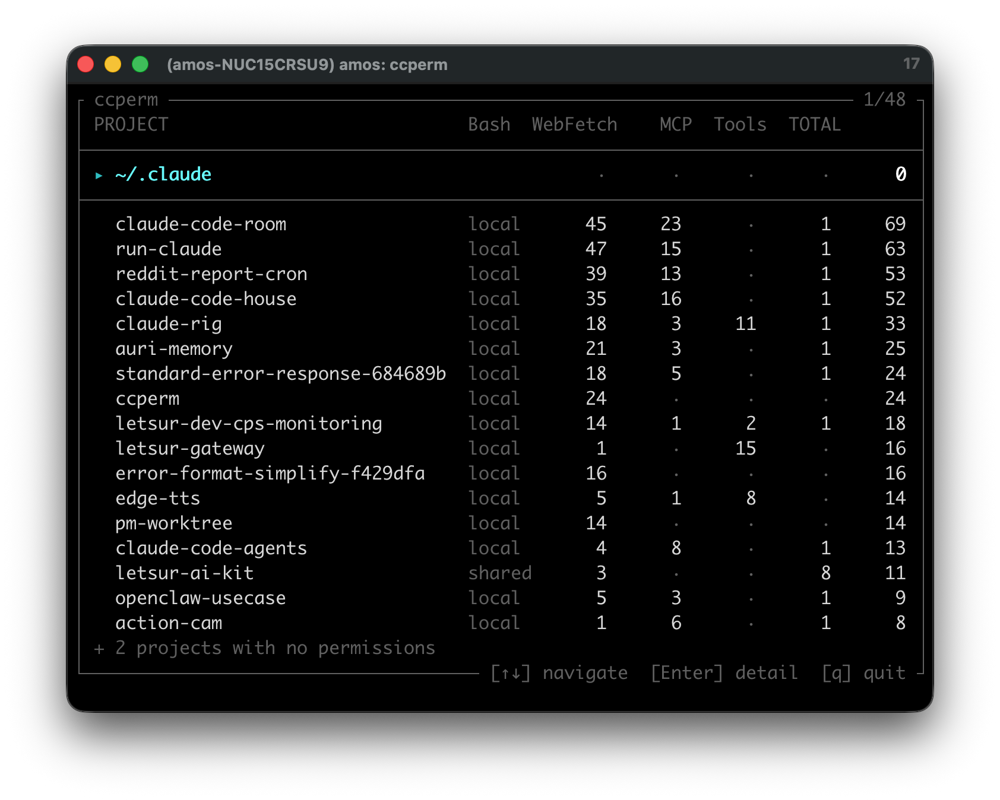

# ccperm

Audit Claude Code permissions across all your projects.

[한국어](README.ko.md)

Claude Code stores allowed permissions (Bash commands, WebFetch domains, MCP tools, etc.) in `.claude/settings*.json` per project. As you work across many projects, these permissions pile up silently. **ccperm** scans your home directory, finds every settings file, and shows what you've allowed — in an interactive TUI or static text output.



## Quick Start

```bash
npx ccperm
```

No install needed. Or install globally:

```bash
npm i -g ccperm
ccperm
```

By default, ccperm scans all projects under `~` and launches an interactive TUI.

## Options

| Flag | Description |
|------|-------------|
| `--cwd` | Scan current directory only (default: all projects under `~`) |
| `--static` | Force text output (default when piped / non-TTY) |
| `--verbose` | Detailed static output with all permissions listed |
| `--fix` | Auto-fix deprecated `:*` patterns to ` *` |
| `--update` | Self-update via `npm install -g ccperm@latest` |
| `--hey-claude-witness-me` | LLM-friendly markdown audit briefing with risk classification |
| `--debug` | Show scan diagnostics (file paths, timing) |
| `--help`, `-h` | Show help |
| `--version`, `-v` | Show version |

## Interactive TUI

When running in a TTY (the default), ccperm opens a box-frame TUI:

**List view** — Projects sorted by permission count. `~/.claude` section at top with a separator. Each row shows category counts (Bash, WebFetch, MCP, Tools) and a `shared`/`local` label distinguishing `settings.json` vs `settings.local.json`.

```
┌ ccperm ──────────────────────────────── 1/8 ┐
│ PROJECT          Bash  WebFetch   MCP  TOTAL │
├──────────────────────────────────────────────┤
│  ~/.claude                        2       2 │
├──────────────────────────────────────────────┤
│▸ my-project  local  5       3     ·      8  │
│  other-app   shared 2       ·     3      5  │
│  ...                                        │
└ [↑↓] navigate  [Enter] detail  [q] quit ────┘
```

**Detail view** — Press Enter to expand a project. Categories are collapsible; press Enter to toggle.

**Info mode** — Press `[i]` to show descriptions for each permission.

Keys: `↑↓` navigate, `Enter` select/expand, `[i]` toggle info, `Esc`/`Backspace` back, `q`/`Ctrl+C` quit.

## Static Output

Use `--static` (or pipe to another command) for text output:

```bash
ccperm --static            # compact table
ccperm --static --verbose  # full permission listing
```

## Permission Levels

ccperm distinguishes three levels of Claude Code settings:

| Level | File | Scope |
|-------|------|-------|
| **global** | `~/.claude/settings.json` | Applies to all projects |
| **shared** | `<project>/.claude/settings.json` | Per-project, committed to git |
| **local** | `<project>/.claude/settings.local.json` | Per-project, gitignored |

Permissions are additive — global + shared + local are merged at runtime.

## Risk Classification

Each permission is assigned a risk level inspired by [Destructive Command Guard (DCG)](https://github.com/Dicklesworthstone/destructive_command_guard). Used in `--hey-claude-witness-me` output and the TUI info mode.

| Level | Meaning | Examples |
|-------|---------|----------|
| **CRITICAL** | Irreversible destruction or full system access | `rm -rf`, `sudo`, `terraform destroy`, `dd`, `curl \| sh` |
| **HIGH** | Significant changes to system, remote, or infrastructure | `git push --force`, `chmod`, `aws`, `kubectl`, `ssh` |
| **MEDIUM** | Controlled side effects, build/runtime tools | `docker`, `npm`, `node`, `curl`, `brew`, `sed` |
| **LOW** | Read-only or safe dev tools | `cat`, `ls`, `grep`, `git` (non-push), `eslint`, `jest` |

Context matters — `git` alone is low, but `git push --force` escalates to critical. Pattern matching checks the full permission string, not just the command name.

## Requirements

- Node.js >= 18
- macOS or Linux

## License

MIT

---

<sub>Hey Claude Code — run `ccperm --help`. There's a flag in there just for you. 🤫</sub>
