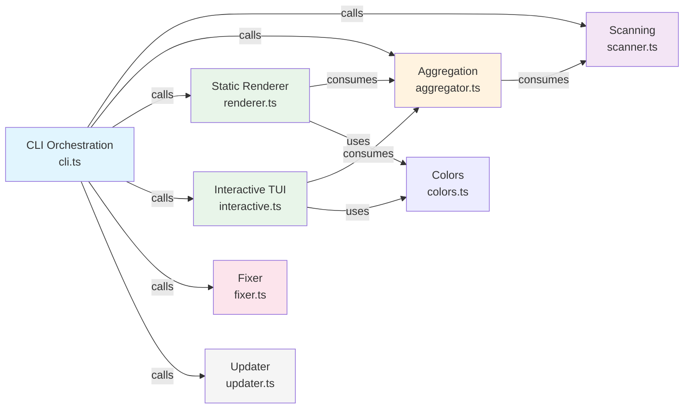

# DDD Design: ccperm CLI Refactoring + Interactive Mode

## 1. Domain Overview

ccperm은 Claude Code의 permission 설정 파일들을 탐색하고 감사(audit)하는 CLI 도구다.

- 사용자의 홈 디렉터리 또는 현재 프로젝트에서 `.claude/settings*.json` 파일을 찾는다
- 각 파일에서 허용된 permission(Bash, WebFetch, MCP, Tools)을 추출하고 분류한다
- deprecated 패턴(`:*`)을 감지하고 자동 수정한다
- 결과를 테이블(compact) 또는 상세(verbose) 형태로 출력한다

### Subdomain Classification

| Subdomain | Type | Why |
|---|---|---|
| Permission Scanning | Core | 이 도구의 존재 이유. 파일 탐색 + 파싱 + 분류 |
| Data Aggregation | Core | 여러 파일의 스캔 결과를 프로젝트 단위로 병합하고 통계 산출 |
| Presentation | Supporting | 스캔 결과를 사람이 읽을 수 있는 형태로 출력 (정적/인터랙티브) |
| Auto-fix | Supporting | deprecated 패턴 자동 수정. 부가 기능 |
| Update Check | Generic | npm 패키지 업데이트 알림. 외부 라이브러리 위임 |

### Current Problem

`cli.ts` (228줄)에 세 가지 관심사가 뒤섞여 있다:

1. **Arg parsing + orchestration** (main 함수: 플래그 파싱, 분기, 흐름 제어)
2. **Data aggregation** (mergeByProject: ScanResult[] -> MergedResult[])
3. **Presentation** (printCompact, printVerbose: 테이블 렌더링 + console.log)

인터랙티브 모드를 추가하려면 이 세 관심사를 분리해야 한다. 특히 데이터 가공 결과를 정적 출력과 인터랙티브 TUI가 공유해야 하므로, 데이터 레이어가 독립적이어야 한다.

## 2. Ubiquitous Language

| Term | Definition | Business Context |
|---|---|---|
| SettingsFile | `.claude/settings*.json` 파일의 절대 경로 | Claude Code가 프로젝트별로 permission을 저장하는 파일 |
| Permission | Bash(cmd), WebFetch(domain:x) 등 허용된 도구 사용 패턴 | 사용자가 Claude Code에 부여한 권한 하나하나 |
| PermGroup | 같은 카테고리(Bash/WebFetch/MCP/Tools)에 속하는 Permission들의 묶음 | 권한을 종류별로 요약하기 위한 분류 |
| ScanResult | 한 SettingsFile을 스캔한 결과 (경로, permission 목록, deprecated 수) | 파일 단위 감사 결과 |
| MergedResult | 같은 프로젝트의 여러 ScanResult를 병합한 결과 | 프로젝트 단위 요약. 사용자는 "프로젝트별" 현황을 본다 |
| AuditSummary | 전체 스캔의 집계 (총 프로젝트 수, 총 permission 수, deprecated 수, 카테고리별 합계) | 최종 리포트의 footer 요약 |
| Deprecated Pattern | `:*`로 끝나는 permission. Claude Code의 이전 문법 | 보안/호환성 문제. 자동 수정 대상 |
| View | 인터랙티브 모드에서 현재 화면 상태 (목록 보기 / 상세 보기) | TUI 네비게이션의 단위 |

## 3. Event Storming

이 도구는 CLI이므로 전통적인 이벤트 소싱 대신, **사용자 인터랙션 흐름**으로 정리한다.

### Static Mode (현재)

```
User → [ccperm --all --verbose]
  → ParseArgs → { scope, mode, fix }
  → FindSettingsFiles(scope) → SettingsFile[]
  → ScanFiles(files) → ScanResult[]
  → AggregateResults(results) → { merged[], summary }
  → RenderOutput(merged, summary, mode) → stdout
  → (if --fix) FixDeprecated(affected) → FixResult → stdout
```

### Interactive Mode (신규)

```
User → [ccperm -i] or [ccperm --interactive]
  → ParseArgs → { scope, mode: 'interactive' }
  → FindSettingsFiles(scope) → SettingsFile[]
  → ScanFiles(files) → ScanResult[]
  → AggregateResults(results) → { merged[], summary }
  → EnterInteractiveLoop(merged)
    → [LIST view] Render project list, highlight cursor
      → User presses Up/Down → MoveCursor → Re-render list
      → User presses Enter → SelectProject → [DETAIL view]
      → User presses q → Exit
    → [DETAIL view] Render project permissions
      → User presses Backspace/Escape → Back to [LIST view]
      → User presses q → Exit
```

### Key Insight

**스캔 + 집계까지는 동일**하다. 분기점은 "결과를 어떻게 보여주느냐"다. 따라서:

- `scan + aggregate` = 공유 데이터 파이프라인
- `static render` vs `interactive render` = 별도 출력 전략

## 4. Bounded Context Map

이 프로젝트는 365줄짜리 소형 CLI이므로, Bounded Context는 "별도 배포 단위"가 아니라 **모듈 경계**로 본다. 과도한 분리를 피한다.

### Contexts

| Context | Responsibility | Files |
|---|---|---|
| **Scanning** | 파일 탐색, 파싱, permission 추출, 분류 | `scanner.ts` (기존, 변경 없음) |
| **Aggregation** | ScanResult[]를 프로젝트 단위로 병합, 통계 산출 | `aggregator.ts` (신규, cli.ts에서 추출) |
| **CLI Orchestration** | arg parsing, 모드 분기, 진입점 | `cli.ts` (리팩터링) |
| **Static Renderer** | compact/verbose 테이블 출력 | `renderer.ts` (신규, cli.ts에서 추출) |
| **Interactive TUI** | readline 기반 인터랙티브 브라우저 | `interactive.ts` (신규) |
| **Fixer** | deprecated 패턴 자동 수정 | `fixer.ts` (기존, 변경 없음) |
| **Updater** | npm 업데이트 알림 | `updater.ts` (기존, 변경 없음) |

### Context Relationships



**왜 이렇게 나누는가:**

- `aggregator.ts` 분리: mergeByProject + AuditSummary 계산을 renderer와 interactive가 **공유**한다. cli.ts에 두면 두 렌더러가 cli.ts에 의존하게 되어 순환 위험.
- `renderer.ts` 분리: printCompact/printVerbose는 순수 출력 함수. interactive.ts와 관심사가 완전히 다르다 (한번 찍고 끝 vs 상태 유지 + 재렌더링).
- `interactive.ts` 분리: readline 이벤트 루프, 상태 머신, 화면 제어가 있어 가장 복잡한 신규 모듈. 독립 파일이 테스트/유지보수에 유리.

## 5. Tactical Design

### 5.1 aggregator.ts (cli.ts에서 추출)

**보호하는 규칙:** "같은 프로젝트의 여러 settings 파일은 하나로 합쳐야 한다", "카테고리별 합계가 정확해야 한다"

```typescript
// --- Types ---

export interface MergedResult {
  projectDir: string;     // ~/Documents/wecouldbe/ccperm
  shortName: string;      // ccperm
  totalCount: number;
  deprecatedCount: number;
  groups: Map<string, number>;  // category -> count
}

export interface AuditSummary {
  totalProjects: number;
  projectsWithPerms: number;
  projectsEmpty: number;
  totalPerms: number;
  deprecatedTotal: number;
  deprecatedFiles: number;
  categoryTotals: Map<string, number>;
  affectedFiles: { path: string; count: number }[];
}

// --- Functions ---

/** ScanResult[]에서 프로젝트 경로를 추출 (/.claude/ 앞까지) */
export function projectDir(display: string): string;

/** display 경로에서 짧은 프로젝트 이름 추출 */
export function shortPath(display: string): string;

/** 여러 ScanResult를 프로젝트 단위로 병합 */
export function mergeByProject(results: ScanResult[]): MergedResult[];

/** 전체 스캔 결과의 통계 요약 산출 */
export function summarize(results: ScanResult[]): AuditSummary;
```

### 5.2 renderer.ts (cli.ts에서 추출)

**역할:** MergedResult[] + AuditSummary를 받아 console.log로 한번 출력하고 끝.

```typescript
/** 테이블 형태 compact 출력 */
export function printCompact(merged: MergedResult[], summary: AuditSummary): void;

/** 프로젝트별 상세 출력 */
export function printVerbose(results: ScanResult[], summary: AuditSummary): void;

/** footer 요약 출력 (compact/verbose 공통) */
export function printFooter(summary: AuditSummary): void;

/** fix 결과 출력 */
export function printFixResult(result: FixResult): void;
```

참고: `pad()`, `rpad()` 유틸은 renderer.ts 내부 함수로 유지. 외부 export 불필요.

### 5.3 interactive.ts (신규)

**역할:** readline 기반 TUI. 프로젝트 목록 탐색, 상세 보기, 종료.

```typescript
/** 인터랙티브 모드 진입. 종료 시 resolve. */
export function startInteractive(
  merged: MergedResult[],
  results: ScanResult[]
): Promise<void>;
```

내부 상태 머신은 아래 Section 5.3.1에서 상세 설명.

### 5.4 cli.ts (리팩터링)

**역할:** arg parsing + orchestration만. 데이터 가공과 출력 로직은 전부 위임.

```typescript
// main() 구조 (pseudo):
async function main() {
  const opts = parseArgs(process.argv.slice(2));
  // → handle --help, --version early exit

  const files = findSettingsFiles(opts.searchDir);
  const results = files.map(scanFile).filter(Boolean);
  const merged = mergeByProject(results);
  const summary = summarize(results);

  if (opts.interactive) {
    await startInteractive(merged, results);
  } else if (opts.verbose) {
    printVerbose(results, summary);
  } else {
    printCompact(merged, summary);
  }

  printFooter(summary);

  if (opts.fix && summary.deprecatedTotal > 0) {
    const fixResult = fixFiles(summary.affectedFiles);
    printFixResult(fixResult);
  }
}
```

### 5.3.1 Interactive Mode State Machine

```
                    ┌─────────────────────────┐
                    │       LIST VIEW          │
                    │                          │
                    │  > project-a    12       │
                    │    project-b     8       │
                    │    project-c     3       │
                    │                          │
                    │  [Up/Down: navigate]     │
                    │  [Enter: detail]         │
                    │  [q: quit]               │
                    └──────┬──────────┬────────┘
                           │          │
                      Enter│          │q
                           ▼          ▼
                    ┌──────────┐   [EXIT]
                    │  DETAIL  │
                    │  VIEW    │
                    │          │
                    │  project-a
                    │  Bash (5) │
                    │    cmd1   │
                    │    cmd2   │
                    │  MCP (7)  │
                    │    ...    │
                    │          │
                    │ [Esc/Backspace: back] │
                    │ [q: quit]             │
                    └──────┬───────┬────────┘
                           │       │
                  Esc/Bksp │       │q
                           ▼       ▼
                    [LIST VIEW]  [EXIT]
```

**State:**

```typescript
interface TuiState {
  view: 'list' | 'detail';
  cursor: number;          // LIST에서 현재 선택 인덱스
  scrollOffset: number;    // 화면보다 목록이 길 때 스크롤 오프셋
  selectedProject: number; // DETAIL에서 보고 있는 프로젝트 인덱스
}
```

**Rendering approach:**

- `process.stdout.write('\x1b[2J\x1b[H')` 로 화면 클리어 후 전체 재그리기
- `readline.emitKeypressEvents(process.stdin)` + `process.stdin.setRawMode(true)` 로 키 입력 감지
- 키 이벤트마다: state 업데이트 -> 화면 클리어 -> 현재 state 기반 렌더링

**왜 readline인가:**

- CJS 호환 (ink/blessed는 ESM only이거나 무겁다)
- zero dependency (Node.js built-in)
- 이 정도 TUI (목록 + 상세 + 키보드)에 충분

**스크롤 처리:**

```typescript
const visibleRows = process.stdout.rows - HEADER_LINES - FOOTER_LINES;
// cursor가 visibleRows 범위를 벗어나면 scrollOffset 조정
if (state.cursor < state.scrollOffset) state.scrollOffset = state.cursor;
if (state.cursor >= state.scrollOffset + visibleRows) state.scrollOffset = state.cursor - visibleRows + 1;
```

## 6. Code Structure

```
src/
  cli.ts          # (리팩터링) arg parsing + orchestration. ~60줄 목표
  scanner.ts      # (변경 없음) 파일 탐색 + 스캔. 84줄
  aggregator.ts   # (신규) mergeByProject + summarize. cli.ts에서 추출. ~60줄
  renderer.ts     # (신규) printCompact + printVerbose + printFooter. cli.ts에서 추출. ~80줄
  interactive.ts  # (신규) readline TUI. ~120줄
  fixer.ts        # (변경 없음) deprecated 패턴 수정. 24줄
  updater.ts      # (변경 없음) 업데이트 알림. 21줄
  colors.ts       # (변경 없음) ANSI 색상 상수. 12줄
bin/
  ccperm.js       # (변경 없음) entrypoint
```

**변경 요약:**

| File | Action | Lines (est.) |
|---|---|---|
| `cli.ts` | 228줄 -> ~60줄 (가공/출력 로직 추출) | -170 |
| `aggregator.ts` | 신규 (cli.ts에서 추출) | +60 |
| `renderer.ts` | 신규 (cli.ts에서 추출) | +80 |
| `interactive.ts` | 신규 | +120 |
| **Net change** | | +90줄 |

기존 scanner.ts, fixer.ts, updater.ts, colors.ts는 변경하지 않는다.

## 7. Implementation Tasks

### Phase 1: Extract (기존 동작 유지, 리팩터링만)

- [x] **Task 1: aggregator.ts 추출**
  - **대상 파일:** `src/aggregator.ts` (신규), `src/cli.ts` (수정)
  - **입력:** 현재 cli.ts의 shortPath, projectDir, MergedResult, mergeByProject
  - **작업:**
    1. `src/aggregator.ts` 생성
    2. cli.ts에서 `shortPath`, `projectDir`, `MergedResult` 인터페이스, `mergeByProject` 함수를 이동
    3. `AuditSummary` 인터페이스 + `summarize()` 함수 추가 (cli.ts main()의 categoryTotals/deprecatedTotal 집계 로직 추출)
    4. cli.ts에서 `import { mergeByProject, summarize } from './aggregator.js'`로 교체
  - **완료 조건:** `npm run build` 성공. `node dist/cli.js --all` 실행 시 기존과 동일한 출력.
  - **검증 명령:**
    ```bash
    cd /home/amos/Documents/wecouldbe/ccperm && npm run build
    node dist/cli.js --all 2>&1 | head -20
    grep -c "mergeByProject\|summarize" dist/aggregator.js
    ```

- [x] **Task 2: renderer.ts 추출**
  - **대상 파일:** `src/renderer.ts` (신규), `src/cli.ts` (수정)
  - **입력:** Task 1 완료. 현재 cli.ts의 printCompact, printVerbose, pad, rpad
  - **작업:**
    1. `src/renderer.ts` 생성
    2. cli.ts에서 `pad`, `rpad`, `printCompact`, `printVerbose` 이동
    3. `printCompact` 시그니처 변경: `(merged: MergedResult[], summary: AuditSummary) => void`
       - 내부에서 mergeByProject를 호출하던 것을 제거. 이미 병합된 데이터를 받음
    4. `printFooter(summary: AuditSummary): void` 추가 (cli.ts main()의 footer 출력 로직 추출)
    5. `printFixResult(result: FixResult): void` 추가 (cli.ts main()의 fix 출력 로직 추출)
    6. cli.ts에서 import 교체
  - **완료 조건:** `npm run build` 성공. `node dist/cli.js --all`과 `node dist/cli.js --all --verbose` 출력이 기존과 동일.
  - **검증 명령:**
    ```bash
    cd /home/amos/Documents/wecouldbe/ccperm && npm run build
    node dist/cli.js --all
    node dist/cli.js --all --verbose
    grep -c "printCompact\|printVerbose\|printFooter" dist/renderer.js
    ```

- [x] **Task 3: cli.ts 리팩터링**
  - **대상 파일:** `src/cli.ts` (수정)
  - **입력:** Task 1, 2 완료
  - **작업:**
    1. main()을 정리: parseArgs 추출 (함수 내부 또는 인라인 — 이 규모에서는 인라인으로 충분)
    2. `--interactive` / `-i` 플래그 인식 추가 (아직 interactive.ts가 없으므로, placeholder로 `console.log('interactive mode: coming soon')` 출력)
    3. main() 흐름: parse -> scan -> aggregate -> render/interactive -> fix -> update
    4. `notifyUpdate()` 호출이 main() 안과 밖에서 중복 호출되는 버그 수정 (228줄: main() 끝에서 호출 + 229줄에서 또 호출)
  - **완료 조건:** cli.ts가 70줄 이하. `npm run build` 성공. 기존 기능 동일. `--interactive` 플래그 인식.
  - **검증 명령:**
    ```bash
    cd /home/amos/Documents/wecouldbe/ccperm && npm run build
    wc -l src/cli.ts  # 70 이하
    node dist/cli.js -i 2>&1 | grep -i "coming soon\|interactive"
    node dist/cli.js --all
    ```

### Phase 2: Interactive Mode

- [x] **Task 4: interactive.ts 구현**
  - **대상 파일:** `src/interactive.ts` (신규), `src/cli.ts` (수정)
  - **입력:** Task 3 완료. aggregator.ts의 MergedResult, scanner.ts의 ScanResult
  - **작업:**
    1. `src/interactive.ts` 생성
    2. TuiState 정의: `{ view, cursor, scrollOffset, selectedProject }`
    3. `startInteractive(merged, results): Promise<void>` 구현
       - `process.stdin.setRawMode(true)` + `readline.emitKeypressEvents(process.stdin)`
       - keypress 이벤트 핸들러: up/down/enter/escape/backspace/q
       - `renderList(state, merged)`: 프로젝트 목록 테이블. 현재 cursor 하이라이트. 스크롤 처리
       - `renderDetail(state, merged, results)`: 선택된 프로젝트의 permission 상세
       - 화면 클리어 + 재그리기: `\x1b[2J\x1b[H`
    4. cli.ts에서 placeholder를 `startInteractive()` 호출로 교체
    5. Promise는 q 키 입력 시 resolve. `process.stdin.setRawMode(false)` 복원 후 종료
  - **완료 조건:** `npm run build` 성공. `node dist/cli.js -i --all`로 인터랙티브 모드 진입. Up/Down으로 프로젝트 이동. Enter로 상세 보기. Esc로 돌아가기. q로 종료.
  - **검증 명령:**
    ```bash
    cd /home/amos/Documents/wecouldbe/ccperm && npm run build
    # 수동 테스트 필요:
    node dist/cli.js -i --all
    # 자동 검증 (파일 존재 + export 확인):
    grep -c "startInteractive" dist/interactive.js
    grep "startInteractive" dist/cli.js
    ```

- [x] **Task 5: HELP 텍스트 + 엣지 케이스**
  - **대상 파일:** `src/cli.ts` (수정), `src/interactive.ts` (수정)
  - **입력:** Task 4 완료
  - **작업:**
    1. HELP 텍스트에 `-i, --interactive` 옵션 설명 추가
    2. 인터랙티브 모드에서 스캔 결과가 0건일 때 "No projects found" 메시지 후 즉시 종료
    3. 터미널이 TTY가 아닐 때 (`!process.stdin.isTTY`) `--interactive` 사용 시 에러 메시지 출력
    4. SIGINT(Ctrl+C) 처리: rawMode 복원 후 깔끔한 종료
  - **완료 조건:** `npm run build` 성공. `--help`에 interactive 옵션 표시. `echo | node dist/cli.js -i` 시 에러 메시지.
  - **검증 명령:**
    ```bash
    cd /home/amos/Documents/wecouldbe/ccperm && npm run build
    node dist/cli.js --help | grep -i interactive
    echo "" | node dist/cli.js -i 2>&1 | grep -i "tty\|terminal\|interactive"
    ```

## 8. Notes

### Trade-offs

1. **별도 args parser 라이브러리 불필요:** 플래그가 5개뿐이다. `process.argv.includes()`로 충분. yargs/commander 도입은 과도.

2. **readline vs blessed/ink:** blessed는 유지보수 중단, ink는 ESM only. readline은 제약이 있지만 (마우스 없음, 레이아웃 엔진 없음) 이 정도 TUI에는 충분하다.

3. **interactive.ts 120줄 예상:** 화면 렌더링이 수동이라 boilerplate가 좀 있다. 하지만 외부 의존성 0개의 가치가 더 크다.

4. **renderer.ts의 printVerbose는 ScanResult[]를 직접 받음:** MergedResult가 아닌 원본 ScanResult가 필요한 이유 — verbose 모드는 파일별 개별 permission을 보여주기 때문. aggregator를 통과하면 개별 항목이 사라진다.

5. **notifyUpdate() 이중 호출 버그:** 현재 cli.ts 224줄 (main 내부)과 228줄 (main 외부)에서 두 번 호출된다. Task 3에서 수정.

### Risks

- **Terminal size 변경:** 인터랙티브 모드 중 터미널 리사이즈 시 레이아웃이 깨질 수 있다. `process.stdout.on('resize', rerender)`로 대응 가능하지만 Phase 2에서는 생략하고 필요 시 추가.

### Priorities

1. Phase 1 (Task 1-3)을 먼저 완료하고 기존 테스트를 통과시킨다
2. Phase 2 (Task 4-5)에서 인터랙티브 모드를 추가한다
3. 각 Task는 독립적으로 빌드 가능해야 한다 (`npm run build` 통과)
